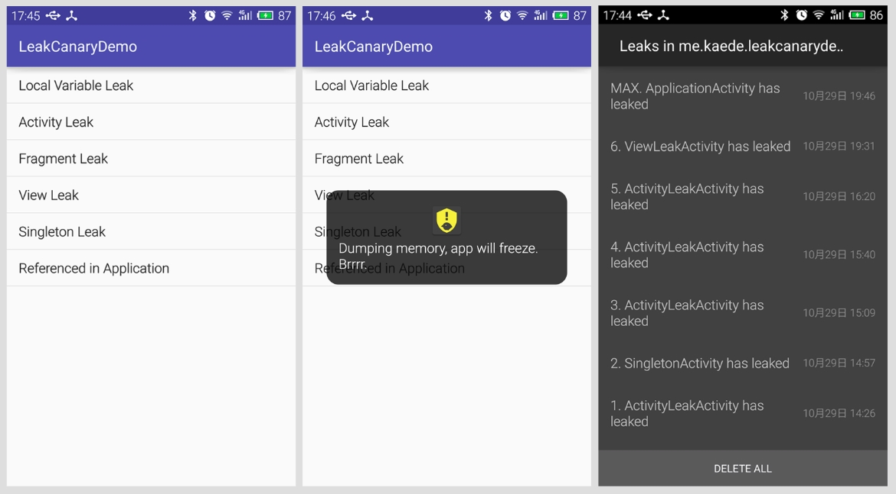

## LeakCanary Demo
[中文版](/doc/readme-cn.md)

Demo project for Square's LeakCanary, a awesome library that help you to detect memory leak in your Android project.

### Project Structure
The package structure is as the following table. 

| Package | Description | 
| :------- | :------ | 
| home | Overview list, do not care about this |
| localvariable | Showcase of local variable leak |
| activityleak | Showcase of Activity leak |
| fragmentleak | Showcase of Fragment leak |
| viewleak | Showcase of local View leak |
| singleton | Showcase of local leak in singleton |
| application | Showcase of leak in Application |

### Preview

